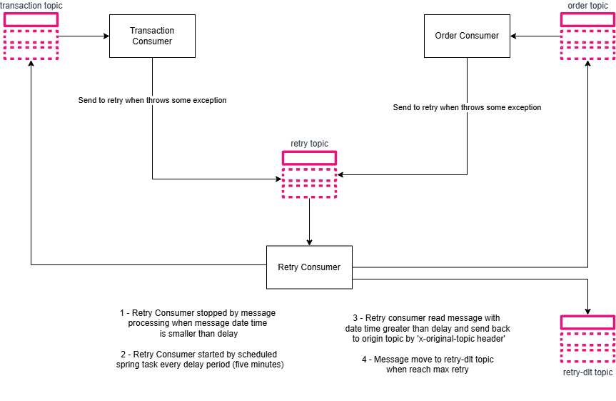

# kafka-retry-strategy
Generic Kafka async retry strategy with multiple topic origins, delayed retry configuration and DLT

## Dependencies
- Java 17+
- Gradle
- Docker
- Docker Compose
- Spring Boot
- Spring Cloud Stream Kafka

## Strategy
The strategy is to use a combination of Kafka topics and a retry mechanism to handle message processing failures. 
The application will consume messages from a source topic, process them, and if processing fails, it will retry the operation a specified number of times with a delay before sending the message to a Dead Letter Topic (DLT).



## Run Application

Execute the following command to run the kafka containers:

```bash
docker-compose up
```

Run the application:

```bash
./gradlew run
```

Access the application at [http://localhost:8080](http://localhost:8080).

To see Kafka topics and messages access the Kafka UI at [http://localhost:9090/](http://localhost:9090/).